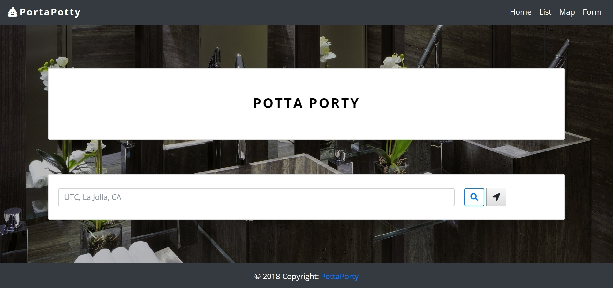

# Potta Porty

# Project Description

Potta Porty is a full-stack application that follows the MVC design pattern. This app allows to user to search for a public restroom by current location, or by a specific location. The user can go to the Listview Page to see a list of the closest 20 restrooms. The Map View marks up to 70 nearby restrooms.

Potta Porty uses MySQL, Node, Express, Handlebars, and the Google Maps and Refuge Restrooms API. Bootstrap is used on the front-end for the design. The font used ('Open Sans') comes from Google Fonts, and the icons come from Font Awesome.

# Technologies Used

* Express.js
* Node.js
* Handlebars
* MySQL
* AJAX/APIs
* jQuery
* Bootstrap
* CSS
* HTML

# Potta Porty Live Link

Potta Porty is deployed to Heroku. Please check it out here:

# Screenshots

