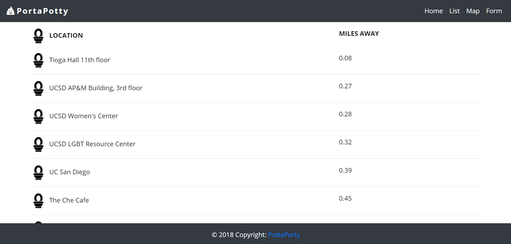
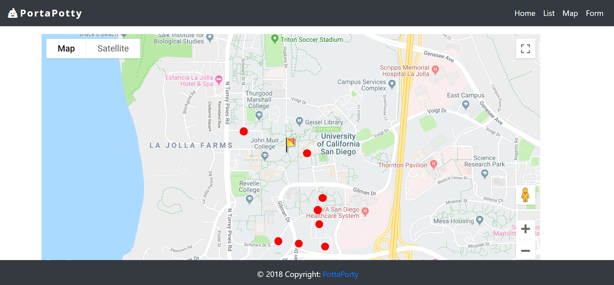

# Potta Porty

# Project Description

Potta Porty is a full-stack application that follows the MVC design pattern. This app allows users to search for public restrooms, either by their current location or by a specific location. A list view provides a list of public restrooms in the area by location and by how many miles away it is, while the map view shows you a map of the restrooms in the area.

PottaPorty uses MySQL, Node, Express, Handlebars, and a bathroom API, as well as the Google Maps API. Bootstrap is used on the front-end for the design. The icons used come from Font Awesome, and the font used ('Open Sans') comes from Google Fonts.

# Technologies Used

* Express.js
* Node.js
* Handlebars
* MySQL
* AJAX/APIs
* Bootstrap
* CSS
* HTML

# Potta Porty Live Link

Potta Porty is deployed to Heroku. Please check it out here:

# Screenshots

